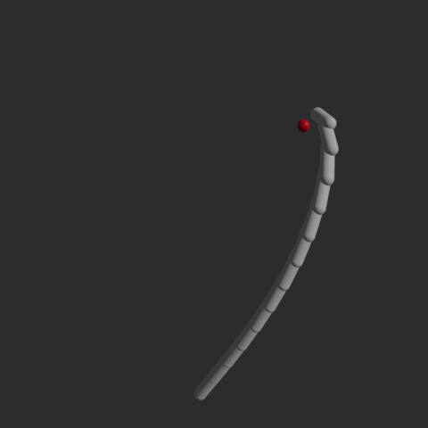

# bevy_fabrik

An implementation of [FABRIK](http://www.andreasaristidou.com/FABRIK.html) inverse kinematics algorithm for [Bevy](https://bevyengine.org/) game engine.



Disclaimer: multi-chain support is not implemented yet.

## How to use

Add `InverseKinematicsPlugin` to your `App`:

```rust
app.add_plugins(InverseKinematicsPlugin);
```

Add `IkChain` component to the last entity (tail) of a chain of entities you want to control:

```rust
commands.entity(chain_tail).insert(IkChain::new(joint_count));
```

Note that `IkChain` will calculate bone lengths based on the distance between entities in the chain when inserted, so make sure the entities and their transforms are set up correctly before inserting it.

Finally, update `IkChain`'s `target` field as needed to solve the chain towards it. For a more complete example, see `examples/basic.rs`.

To add joint constraints, insert `TwistConstraint` and/or `SwingConstraint` components to the entities within the chain, and they will be applied during chain solving.

## Compatibility
| Bevy | bevy_fabrik |
|------|-------------|
| 0.15 | 0.2         |
| 0.14 | 0.1         |

## Alternatives

* [bevy_ik](https://github.com/gschup/bevy_ik)
* [bevy_mod_inverse_kinematics](https://github.com/Kurble/bevy_mod_inverse_kinematics)

## License

Dual-licensed under either:


* MIT License ([LICENSE-MIT](LICENSE-MIT) or [http://opensource.org/licenses/MIT](http://opensource.org/licenses/MIT))
* Apache License, Version 2.0 ([LICENSE-APACHE](LICENSE-APACHE) or [http://www.apache.org/licenses/LICENSE-2.0](http://www.apache.org/licenses/LICENSE-2.0))

at your option.


